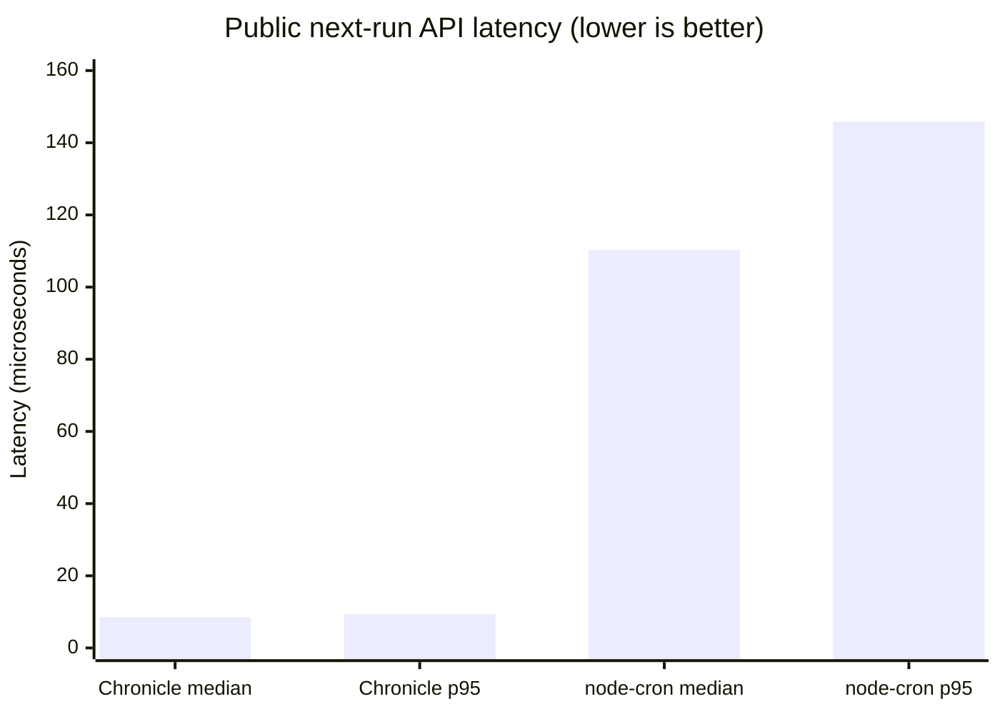

# Chronicle

[](https://github.com/NooledIt/Chronicle/actions/workflows/ci.yml)
[](https://github.com/NooledIt/Chronicle/releases/latest)
[](LICENSE)
[](node/package.json)
[](Cargo.toml)

Chronicle is a deterministic cron-occurrence engine focused on a failure-prone
part of scheduling: interpreting wall-clock schedules across timezone and
daylight-saving transitions.

The current release is a Rust core library. It evaluates a schedule to the
first matching instant strictly after an input instant, either in UTC or an
IANA timezone.

## Why Chronicle

Many schedulers leave the repeated hour at daylight-saving fall-back implicit.
Chronicle makes it a deliberate API choice:

- `DstPolicy::WallClockOnce` runs the earlier occurrence only.
- `DstPolicy::WallClockTwice` runs both occurrences.
- A nonexistent local minute during spring-forward is skipped.

These behaviors are covered by fixed transition tests for `America/New_York`,
alongside property tests and an independent JSON conformance corpus.

## Performance compared with node-cron

On an Apple M2 Pro, Chronicle's public `nextOccurrence` operation measured
**12.91x lower median latency** and **15.63x lower p95 latency** than the
closest public node-cron next-run path. Lower values are better.



| Implementation and measured operation | Median latency | p95 latency | Relative latency (median / p95) |
| --- | ---: | ---: | ---: |
| Chronicle `nextOccurrence` | **8.542 us** | **9.333 us** | **1.00x / 1.00x** |
| node-cron `createTask` -> `start` -> `getNextRun` -> `stop` | 110.292 us | 145.833 us | 12.91x / 15.63x |

### Benchmark labels and method

- **Workload:** compute the next occurrence of `*/15 * * * *`.
- **Sample size:** seven independent processes with 2,000 measured operations
  per process; the table reports the median of each run's median and p95.
- **Environment:** Apple M2 Pro, macOS 26.5.2 arm64, Node.js 26.0.0, and
  node-cron 4.6.0.
- **Observed ranges:** Chronicle run medians were 8.541-8.583 us; node-cron run
  medians were 108.250-112.166 us.
- **Reproduction:** from `node/`, run `npm install`, `npm run build`, and then
  `npm run benchmark`.

This is a comparison of the closest **public APIs**, not a parser-only
microbenchmark. Chronicle evaluates a supplied instant directly, while
node-cron exposes next-run evaluation through a started task, so the node-cron
measurement necessarily includes public task-lifecycle overhead. The result
supports the scoped latency claim above; it does not imply that every scheduler
workload is 12-16x faster. See the [benchmark protocol](benchmarks/REPORT.md)
and [full comparison report](docs/comparison-report.md) for the compatibility,
correctness, and interpretation boundaries.

## Supported grammar

Chronicle supports the standard five-field form and an optional leading
seconds field:

```text
[second] minute hour day-of-month month day-of-week
```

Each field accepts:

- `*` — any value
- An integer in the field's range;
- comma-separated lists (`1,5,9`), inclusive ranges (`9-17`), and steps over
  a wildcard or range (`*/15`, `9-17/2`);
- three-letter or full English month and weekday names (`Jan`, `September`,
  `Mon`, `Friday`);
- wrapping ranges (`22-2`, `Fri-Mon`), `L`/`L-n`, nearest weekdays (`15W`,
  `LW`), nth/last weekdays (`Mon#2`, `5L`), and `?` in either day field.

The ranges are second/minute `0-59`, hour `0-23`, day-of-month `1-31`, month
`1-12`, and day-of-week `0-7` (`0` and `7` are Sunday). With five fields,
seconds are implicitly `0`. All fields must match, including day-of-month and
day-of-week.

## Example

```rust
use chrono::{TimeZone, Utc};
use chrono_tz::America::New_York;
use chronicle_core::{DstPolicy, Schedule};

let schedule = Schedule::parse("30 1 * * *")?;
let after = Utc.with_ymd_and_hms(2026, 11, 1, 5, 30, 0).unwrap();
let next = schedule.next_after_in_timezone(
    after,
    New_York,
    DstPolicy::WallClockTwice,
)?;

assert_eq!(next.to_rfc3339(), "2026-11-01T06:30:00+00:00");
# Ok::<(), chronicle_core::CronError>(())
```

## Development

Requires a current Rust toolchain.

```bash
cargo test --workspace
```

GitHub Actions runs the Rust and Node suites on macOS (Intel and Apple
Silicon), Linux, and Windows. Publishing a GitHub Release rebuilds each native
addon, attaches loader-named platform binaries and SHA-256 checksums to that
release, and attaches a macOS benchmark report. These are integration assets:
the package is still private and does not yet provide npm optional-dependency
packages for transparent cross-platform installation. See [the benchmark
protocol](benchmarks/REPORT.md) for the scope and interpretation of those
results.

Maintainers publish a release through the **Mark a release** GitHub Actions
workflow. It uses the repository-scoped `GITHUB_NOOL_PUBLIC_TOKEN` secret to
create the release; the `release.published` workflow then builds and attaches
the binaries, checksums, and benchmark evidence.

The test suite includes:

- JSON conformance fixtures for UTC schedules;
- fixed DST transition cases;
- generated property tests for occurrence ordering and field constraints;
- malformed-input regression tests.

## Node API (local addon)

The `node/` package exposes the native core to Node.js through N-API. Build it
locally before use:

```bash
cd node
npm install
npm run build
```

```js
const { nextOccurrence } = require('./node')

nextOccurrence('*/15 * * * *', '2026-01-15T09:01:00Z')
// '2026-01-15T09:15:00Z'

nextOccurrence('30 1 * * *', '2026-11-01T05:30:00Z', {
  timezone: 'America/New_York',
  dstPolicy: 'wallClockTwice',
})
// '2026-11-01T06:30:00Z'
```

`timezone` accepts an IANA zone. `dstPolicy` is `wallClockOnce` by default and
may also be `wallClockTwice`.

For in-process jobs, Chronicle also provides a small lifecycle wrapper:

```js
const { schedule } = require('./node/scheduler')

const task = schedule('*/5 * * * *', refreshCache, {
  timezone: 'UTC',
  noOverlap: true,
  maxExecutions: 12,
  maxRandomDelay: 30_000,
  name: 'cache-refresh',
})
```

Tasks support `start`, `stop`, `destroy`, `execute`, `getStatus`, and
`getNextRun`. They emit `executed`, `overlap`, `error`, and `destroyed` events.

## npm installation and node-cron migration

For the supported inline-task subset, Chronicle has the same common entry
points as node-cron:

```bash
npm install @nool/chronicle
```

```js
const cron = require('@nool/chronicle')
const task = cron.schedule('*/5 * * * *', refreshCache, {
  timezone: 'UTC', noOverlap: true,
})
```

`schedule`, `createTask`, `validate`, `validateDetailed`, `parse`, task
registry access, and shutdown are included. Background module paths execute in
an isolated child process. Distributed jobs accept node-cron's
`distributed`, `runCoordinator`, and `distributedLease` options and fail
closed when election fails. See the [feature-parity matrix](docs/feature-parity.md)
for the remaining non-goals.

## Built with Nool

Chronicle was built as an evaluation of [Nool](https://nool.dev), a semantic
version-control and task-orchestration tool. Rather than treating commits as
the only record of work, we used Nool to make each implementation step
traceable:

- Defined acceptance criteria for the UTC evaluator, timezone/DST behavior,
  property-based safety checks, documentation, and release hygiene.
- Announced intended file footprints and checked for conflicts before changes.
- Proposed and solidified each tested change as a semantic Knot, retaining its
  intent, affected paths, and validation evidence.
- Ran Nool's structural verification, release-health checks, and audit report
  before publishing the repository.

This process does not by itself prove Chronicle is better than an established
scheduler. It gives the project a reproducible causal record from requirement
to test to released change, which is the foundation for an independent quality
comparison.

See the measured, scope-bounded [Chronicle vs. node-cron evaluation
report](docs/comparison-report.md) for compatibility, DST behavior, and
additional macOS benchmark evidence.

## Contributing

Please read [CONTRIBUTING.md](CONTRIBUTING.md) before opening an issue or pull
request, and follow the [Code of Conduct](CODE_OF_CONDUCT.md). Bug and feature
forms are available in GitHub Issues; design proposals use
[the proposal template](docs/proposals/template.md).

## Current limitations

Chronicle remains an in-memory scheduler: it does not persist jobs or provide
durable retries after process failure. Distributed coordination requires a
caller-provided coordinator such as a Redis-backed lease implementation. The bounded
differential harness against `node-cron` is documented in [the benchmark
protocol](benchmarks/REPORT.md), including what the comparison does and does
not prove.

## License

Chronicle is released under the [MIT License](LICENSE).
