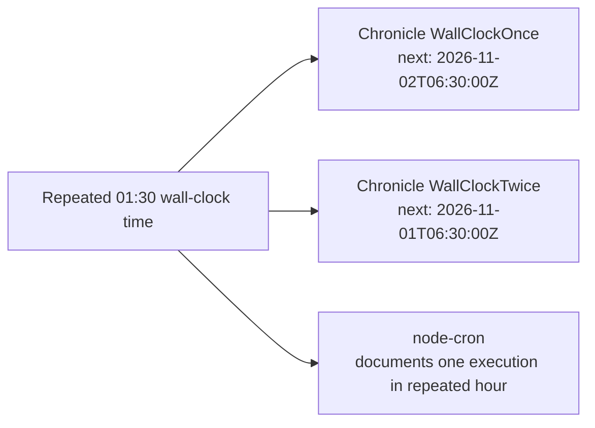

# Chronicle vs. node-cron: evaluation report

**Measured:** 2026-07-30 on an Apple M2 Pro, macOS 26.5.2 (`darwin-arm64`),
Node v26.0.0, Rust 1.95.0, Chronicle 0.1.1, and node-cron 4.6.0.

## Decision summary

Chronicle is the stronger choice when an application needs a deterministic
*next occurrence after this supplied instant* calculation and an explicit
policy for the repeated DST hour. It is **not** currently a replacement for
node-cron as a general Node.js scheduling product: Chronicle now covers its
documented syntax, background paths, and coordinator contract, while node-cron
retains the more mature operating history and public distribution footprint.

The performance result below is real for the measured public paths, but is not
a general claim that one scheduler is intrinsically 13.62x faster. Chronicle
evaluates a supplied instant, while node-cron's closest public path creates,
starts, queries, and stops a task.

## Compatibility evidence

The differential harness passed all 6 valid shared expressions and all 4
invalid expressions. The shared corpus covers five/six fields, literals,
lists, ranges, steps, names, and Sunday as both `0` and `7`.

| Area | Chronicle 0.1.1 | node-cron 4.6.0 | Assessment |
| --- | --- | --- | --- |
| Five/six fields, lists, ranges, steps, names | Supported; 10 validation cases and 6 next-run cases agree | Supported | Shared subset matches |
| Advanced calendar syntax | Supports `L`, `L-n`, `W`, `LW`, `#`, `?`, weekday `L`, and inverted ranges | Supports those extensions | Differential corpus matches |
| Timezone behavior | IANA zones, fixed-instant evaluator | Task timezone | Different but useful models |
| DST repeated hour | Caller chooses once or twice | Documents one execution in the repeated hour | Chronicle has an explicit policy dimension |
| Lifecycle controls | Start/stop/destroy/status, overlap guard, jitter, run limit | Equivalent core controls and richer task context | Near parity for local controls |
| Distributed coordination/background process | Implemented with caller coordinator and isolated worker | Implemented | Compatible contract; independent implementation |
| Durable retries/persistence | Not implemented | Not a node-cron guarantee either | Neither is a durable job queue |
| Distribution | Private local N-API package; release assets planned | Public, zero-dependency npm package | node-cron leads |

node-cron's documented feature set and DST statement are the source for the
incumbent-side entries: [node-cron documentation](https://www.nodecron.com/)
and [node-cron 4.6.0 package documentation](https://www.npmjs.com/package/node-cron).
Chronicle's support claims are backed by its local Rust, Node, and differential
test suites.

## macOS performance evidence

Each sample warmed the operation, then recorded 2,000 timings. Five separate
Node processes were run. The table reports the median of those five summary
values; lower is better.

| Public path measured | Median (μs) | p95 (μs) | Relative to Chronicle |
| --- | ---: | ---: | ---: |
| Chronicle `nextOccurrence(expression, after)` | 8.167 | 8.583 | 1.00x |
| node-cron `createTask/start/getNextRun/stop` | 111.208 | 142.167 | 13.62x median / 16.56x p95 |

```text
Median latency (μs; lower is better)
Chronicle  8.167  ███
node-cron 111.208 ████████████████████████████████████████

p95 latency (μs; lower is better)
Chronicle  8.583  ███
node-cron 142.167 ██████████████████████████████████████████████████
```

Individual median samples (μs): Chronicle `8.167, 8.167, 8.167, 8.167,
8.166`; node-cron `112.625, 113.417, 109.500, 111.208, 110.666`.

## DST evidence

For `30 1 * * *` in `America/New_York`, after
`2026-11-01T05:30:00Z`:



This is a capability distinction, not a direct point-in-time node-cron test:
node-cron's public next-run API uses the live clock rather than accepting a
supplied historical instant.

## Limits and next decisions

1. Describe compatibility as the tested node-cron surface, not a guarantee for
   undocumented internals or persistent job-queue behavior.
2. Use Chronicle's performance number only with the public-path caveat. A fair
   parser-only incumbent benchmark would require an upstream-exposed API or a
   separately reviewed internal benchmark.
3. To make a stronger quality claim, complete the tracked parity task with
   independent fixtures for each adopted extension, then run the corpus on the
   GitHub macOS, Linux, and Windows matrix.
4. To become installable like node-cron, publish optional platform packages or
   a package-level binary downloader; raw release assets alone are not enough.

## Reproduction

```bash
cd node
npm ci
npm run build
npm test
npm run compare
for run in 1 2 3 4 5; do npm run benchmark; done
```
