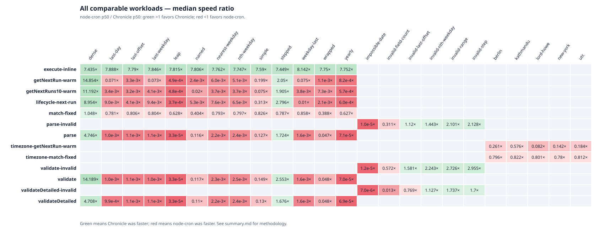
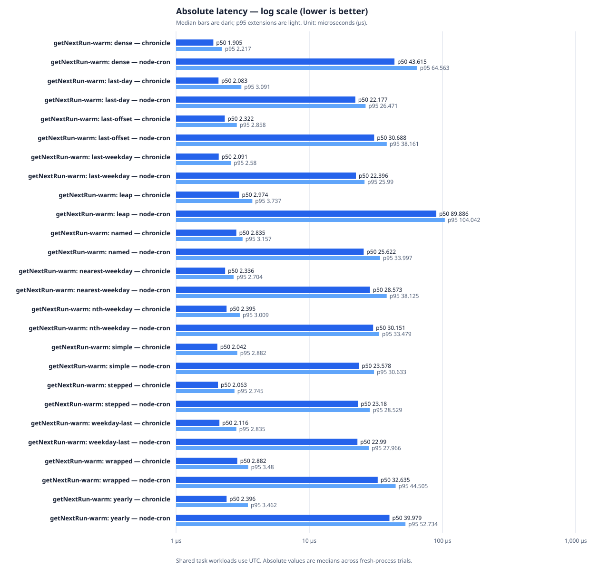
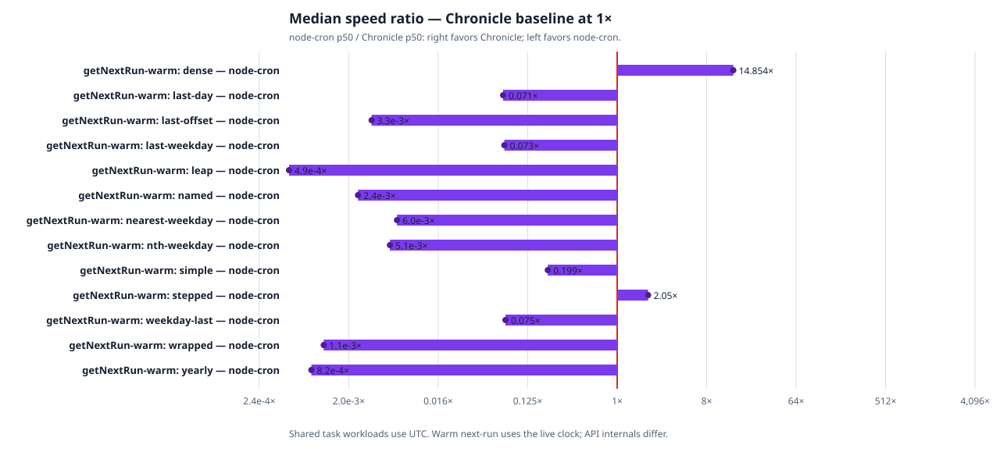

# Optimized Chronicle vs. node-cron 4.6.0

**Measured:** 2026-07-30 on an Apple M2 Pro, macOS 26.5.2
(`darwin-arm64`), Node.js 26.0.0, Chronicle optimizer commit `49183b5`
(package manifest 0.3.0, release-native build), and node-cron 4.6.0.

## Decision summary

Chronicle won **128 of 132 comparable public API/workload pairs**. More
importantly, it won all **114 valid scheduling/API pairs** spanning parsing,
validation, fixed matching, next-run calculation, lifecycle, inline execution,
advanced syntax, sparse dates, and five time zones. The four losses are
invalid-input validation and error-detail paths.

This supersedes the earlier checked-in performance snapshot. That snapshot
measured the old minute/second scanner through a debug native build; the new
evidence records a release build and immutable core Git revision.

## Result overview

The ratio is `node-cron p50 / Chronicle p50`. Values above 1 favor Chronicle;
values below 1 favor node-cron.

| Public API suite | Cases | Chronicle wins | node-cron wins | Median case ratio |
| --- | ---: | ---: | ---: | ---: |
| Inline manual execution | 13 | 13 | 0 | 7.716x |
| Warm `getNextRun()` | 13 | 13 | 0 | 11.610x |
| Warm `getNextRuns(10)` | 13 | 13 | 0 | 12.471x |
| Full create/start/next/stop/destroy lifecycle | 13 | 13 | 0 | 9.374x |
| Fixed-date task match | 13 | 13 | 0 | 3.256x |
| Valid parse | 13 | 13 | 0 | 3.122x |
| Valid validation | 13 | 13 | 0 | 10.914x |
| Detailed valid validation | 13 | 13 | 0 | 3.082x |
| Timezone warm next-run | 5 | 5 | 0 | 11.535x |
| Timezone fixed match | 5 | 5 | 0 | 3.277x |
| Invalid parse/validation variants | 18 | 14 | 4 | mixed |
| **Total** | **132** | **128** | **4** | — |



## Warm next-run latency

These cases pre-create and start one task per implementation, then measure the
public `getNextRun()` call. Both tasks use `timezone: "UTC"`; the calculation
uses the live clock.





| Expression class | Chronicle p50 (us) | node-cron p50 (us) | Paired median ratio | Assessment |
| --- | ---: | ---: | ---: | --- |
| Every second | **1.905** | 43.615 | 22.895x | Chronicle win |
| Every 15 minutes | **2.063** | 23.180 | 11.318x | Chronicle win |
| Daily at 09:00 | **2.042** | 23.578 | 11.610x | Chronicle win |
| Last day of month | **2.083** | 22.177 | 10.647x | Chronicle win |
| Nearest weekday | **2.336** | 28.573 | 12.232x | Chronicle win |
| Named month/day/range | **2.835** | 25.622 | 9.083x | Chronicle win |
| Wrapped month/hour/day ranges | **2.882** | 32.635 | 11.295x | Chronicle win |
| Yearly | **2.396** | 39.979 | 16.735x | Chronicle win |
| Leap day | **2.974** | 89.886 | 30.619x | Chronicle win |

Across all 13 warm next-run expression classes, Chronicle's paired median
advantage ranges from 9.083x to 30.619x. The median workload ratio is 11.610x;
the data does not support claiming that every workload is specifically 13-16x.

## What changed

The old evaluator advanced one second for six-field expressions or one minute
for five-field expressions until every field matched. The optimized evaluator:

- jumps directly to an allowed month;
- scans only actual dates needed for ordinary and advanced day rules;
- jumps directly across disallowed hours, minutes, and seconds;
- uses checked calendar arithmetic and retains the ten-year bound;
- evaluates the entire ambiguous wall-clock window under `WallClockTwice`,
  choosing the earliest future real instant.

Correctness is backed by an independent brute-force oracle over 192
deterministic randomized schedules, exact sparse and advanced-calendar cases,
existing JSON conformance/property tests, and repeated-hour DST regressions.

## Real scheduling observations

The runtime suite executes each library/scenario pair in a fresh process with
watchdogs and full task cleanup. It remains separate from the seven-trial
CPU/API suite.

| Scenario | Chronicle | node-cron | Interpretation |
| --- | ---: | ---: | --- |
| Single task, second-boundary phase | 1 ms | 3 ms | Both delivered 2/2 callbacks |
| 100-task fan-out, second-boundary phase | 3 ms | 7 ms | Both delivered 200/200 callbacks |
| Inline execute throughput | 289,134 ops/s | 37,301 ops/s | Chronicle 7.75x higher |
| Background cold total | 96.625 ms | 111.695 ms | Chronicle 1.16x lower |
| Background warm IPC | 15,996 ops/s | 9,026 ops/s | Chronicle 1.77x higher |
| Coordinator allow | 2 decisions, 2 callbacks | 2 decisions, 2 callbacks | Contract matched |
| Coordinator deny | 2 decisions, 2 skips | 2 decisions, 2 skips | Contract matched |

The timer cases contain only two scheduled slots and establish delivery and
behavior, not stable tail latency. In the five-slot 1.5-second `noOverlap`
case, both implementations kept maximum concurrency at one; node-cron emitted
two overlap events while Chronicle emitted none because their rearming models
differ.

## Compatibility evidence

The differential corpus covers five/six fields, literals, lists, ranges,
steps, names, advanced calendar tokens, wrapped ranges, and invalid forms.

| Area | Chronicle optimized main | node-cron 4.6.0 | Assessment |
| --- | --- | --- | --- |
| Core and advanced grammar | Five/six fields plus `L`, `L-n`, `W`, `LW`, `#`, `?`, and wrapped ranges | Same tested surface | Shared corpus matches |
| Timezone behavior | IANA zones and fixed-instant evaluator | Task timezone | Shared task cases use explicit UTC |
| DST repeated hour | Caller chooses once or twice, ordered by real instant | Documents one execution | Chronicle exposes an additional tested policy |
| Lifecycle | Start/stop/destroy/status, overlap guard, jitter, run limit | Equivalent core controls | Near parity |
| Background modules | Persistent isolated child process | Isolated background task | Both pass runtime checks |
| Distributed coordination | Caller-provided coordinator | Caller-provided coordinator | Allow/deny contract passes; multi-host contention remains out of scope |

## Method and statistical boundaries

- Seven trials; one fresh child process per library per trial; library order
  alternates.
- Chronicle's N-API addon is compiled with Rust release optimizations.
- `process.hrtime.bigint()` timing with adaptive batches and a time budget.
- Aggregates report median process p50/p95, median absolute deviation, raw
  trial values, and deterministic bootstrap 95% confidence intervals.
- Chronicle-only `nextOccurrence(expression, after)` results are retained but
  marked non-comparable because node-cron has no public fixed-after API.
- Validation is not internally equivalent: Chronicle validates by finding an
  occurrence, while node-cron performs conversion-oriented validation.
- Results apply to this machine, runtime, versions, expressions, and public
  API paths. They do not establish universal performance on every scheduler
  or environment.

## Reproduction and evidence

```bash
cd node
npm ci
npm run build:release
npm test
npm run compare
CHRONICLE_BENCHMARK_BUILD_PROFILE=release npm run benchmark -- --runs 7 \
  --output ../benchmarks/results/macos-arm64-main-49183b5-extensive.json
CHRONICLE_BENCHMARK_BUILD_PROFILE=release npm run benchmark:runtime -- \
  --output ../benchmarks/results/macos-arm64-main-49183b5-runtime.json
node ../benchmarks/render-report.cjs \
  --input ../benchmarks/results/macos-arm64-main-49183b5-extensive.json \
  --runtime ../benchmarks/results/macos-arm64-main-49183b5-runtime.json \
  --output-dir ../docs/benchmark-results
```

- [Generated warm next-run summary](benchmark-results/summary.md)
- [Raw seven-trial CPU/API evidence](../benchmarks/results/macos-arm64-main-49183b5-extensive.json)
- [Raw runtime evidence](../benchmarks/results/macos-arm64-main-49183b5-runtime.json)
- [Benchmark protocol](../benchmarks/REPORT.md)
